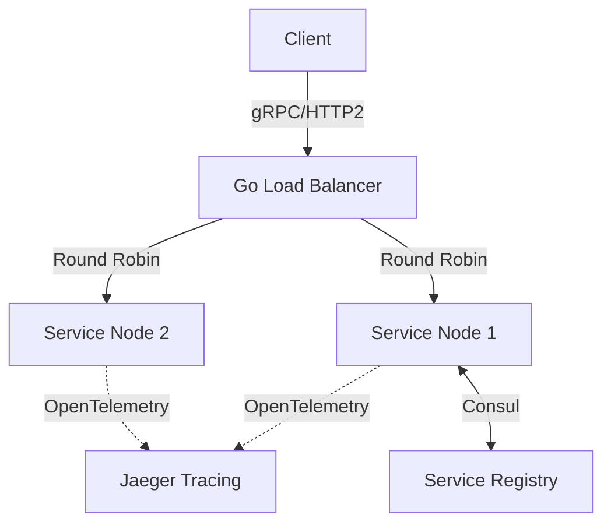

# Go-Load-Balancer


A production-ready Layer 7 reverse proxy load balancer written in Go, featuring active health checking, atomic round-robin routing, and distributed tracing hooks.

## System Architecture





## Elite Features
- **Lock-Free Routing**: `sync/atomic` operations for zero-contention round robin.
- **Active Health Checks**: Background goroutine polling upstream health.
- **Tracing Ready**: Request header injection for OpenTelemetry spans.

## Quick Start
```bash
go mod tidy
go test ./...
go run main.go
```
